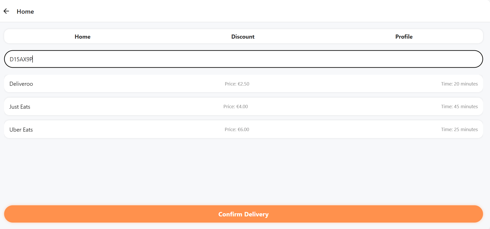
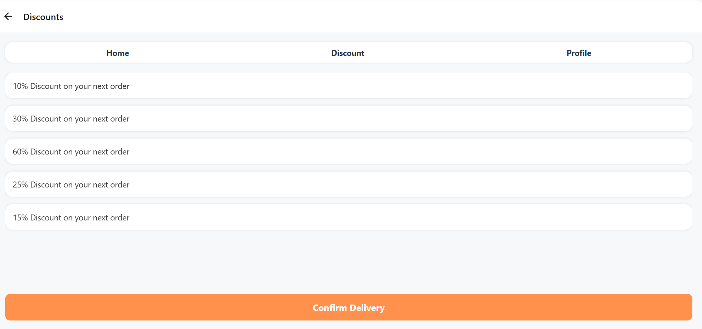

# Fast Food Delivery App

## Overview

The Fast Food Delivery App is a React Native-based mobile application designed to provide users with an easy way to order food from popular delivery services like Deliveroo, Just Eats, and Uber Eats. The app allows users to select their preferred delivery service based on their location (Eircode), apply available discounts.

The app uses Firebase Authentication for user login and signup, ensuring a secure and seamless user experience. Users can browse the available discounts and apply them to their orders for extra savings. 

## Features

- **User Authentication**:
   Users can sign up and log in using Firebase Authentication with their email and password. This enables user account management, ensuring that users can track their 
   activity and place orders securely.
- **Dynamic Delivery Options**:
    Upon entering an Eircode (Irish postal code), users can view and select from a list of available delivery services, such as Deliveroo, Just Eats, and Uber Eats
- **Discounts**:
    The app includes a discounts feature where users can view and apply discounts to their orders.
- **Responsive UI**:
    The app is designed to work across multiple screen sizes and devices.
- **Order Confirmation**:
    Once the user selects a delivery service and applies a discount, they can confirm the delivery. The app displays a confirmation alert, signaling that the delivery is on 
    its way.
- **Navigation**:
    The app uses a tab-based navigation system, with tabs for Home, Discounts, and Profile. This makes it easy for users to navigate between different sections of the app.

## Screenshots

### Home Screen
The home screen allows users to enter their Eircode to check for available delivery services. The available services are displayed along with delivery times and prices.

### Discounts Screen
Once the user selects a delivery option, they can view available discounts on the discounts screen. They can apply these discounts to their order.

## Technologies Used

- **React Native**: Framework for building the mobile app.
- **Firebase**: Used for user authentication and Firestore database for saving user data.
- **JavaScript**: JavaScript is the primary programming language used for writing the app's logic, including fetching data, managing state, and handling user interactions.

